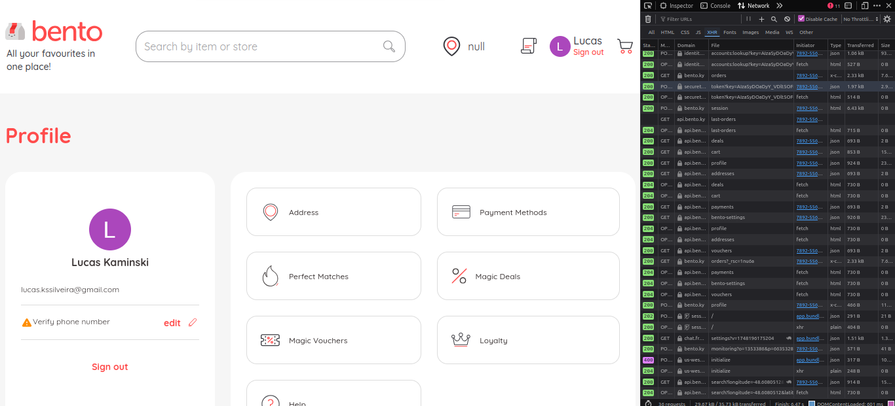
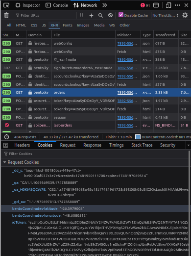

# Enviroment Variables

It's necessary to set the environment variables for the project to run correctly. The following variables are required:

## USER_SESSION_TOKEN

1. Go to the [Bento sign in session website](https://bento.ky/sign-in?return=profile) and login with your credentials. For the example, I'll use the login with google button, but you can use any other method, it works the same way.

   

2. After logging in, open the developer tools with F12 key and go to the "Network" tab. It will be clean, so configure the filters to show only the "XHR" requests, after that, press the "F5" key to refresh the page. This will show all the requests made by the page.

   

3. Select one of the requests and go to the "Cookies" tab. For the example, I'll use the request to the "/orders" endpoint. Inside the section, you will find different keys with values, the one we looking for is the "idToken", copy this value and past on your .env file as the value of the USER_SESSION_TOKEN variable.

   

### Notes

Inspecting the token through the [jwt.io website](https://jwt.io/) will show you the expiration date of the token. This token is valid for 1 hour, so if you want to use it for a longer period of time, you will need to refresh it every hour. If necessary, repeat the steps above to get a new token.

```json
{
  "name": "NAME",
  "picture": "PIC_LINK",
  "iss": "https://securetoken.google.com/bento-ky",
  "aud": "bento-ky",
  "auth_time": 1748195008,
  "user_id": "USER_ID",
  "sub": "USER_ID",
  "iat": 1748195009,
  "exp": 1748198609,
  "email": "USER_EMAIL",
  "email_verified": true,
  "firebase": {
    "identities": {
      "google.com": ["GOOGLE_ID"],
      "email": ["USER_EMAIL"]
    },
    "sign_in_provider": "google.com"
  }
}
```

Above is an example of the decoded token. The "exp" field indicates the time when the token will expire. The "iat" field is set to 1748195009 and the "exp" field is set to 1748198609, subtracing the two values gives us 3600 seconds, which is equal to 1 hour. This means that the token will expire in 1 hour after it was issued.

Other important fields are the "user_id" and "sub" fields, which could be used to the next enviroment variable.

## USER_ID

With the token in hand, we can get the user id. This is the same as the "user_id" and "sub" fields in the token. You can use any of them, but for this example, I'll follow the way suggested in the PDF file. To get the user id, you can use the following command, a curl call to the endpoint "/users/profile" with the token as a bearer token. This will return a JSON object with the user information, including the user id.

```bash
curl --location 'https://api.bento.ky/api/v1/users/profile' \
--header 'authorization: Bearer USER_SESSION_TOKEN' \
--header 'accept: application/json'
```

The response will look like this:

```json
{
  "name": "NAME",
  "displayName": "NAME",
  "email": "EMAIL",
  "uuid": "USER_ID",
  "cartId": "CART_ID",
  "addressBookCount": 0,
  "paymentMethodsCount": 0,
  "perfectMatchCount": 0
}
```

The "uuid" field is the user id, copy this value and paste it on your .env file as the value of the USER_ID variable.

With this, you have all the environment variables set up. You can now run the project and it should work correctly.

If you want to validate both variables, you can use the endpoint "/delivery/fee" with the following payload in example, with the curl command:

```bash
curl --location 'https://api.bento.ky/api/v1/delivery/fee' \
--header 'accept: application/json' \
--header 'authorization: Bearer USER_SESSION_TOKEN' \
--header 'content-type: application/json' \
--data '{
"addressFrom": {
"coordinates": {
"lat": 19.3331008,
"lng": -81.3801101
}
},
"addressTo": {
"coordinatesAdjustment": {
"lat": 19.280354483797733,
"lng": -81.37386862188578
}
},
"merchant": {
"id": "8JbEqL0RTgHfRREvtSuO"
},
"user": {
"uuid": "USER_ID"
}
}'
```

The response will look like this:

```json
{
  "fee": 813,
  "deliveryTime": 0,
  "distanceMeters": 6651.610000000001,
  "message": null
}
```
